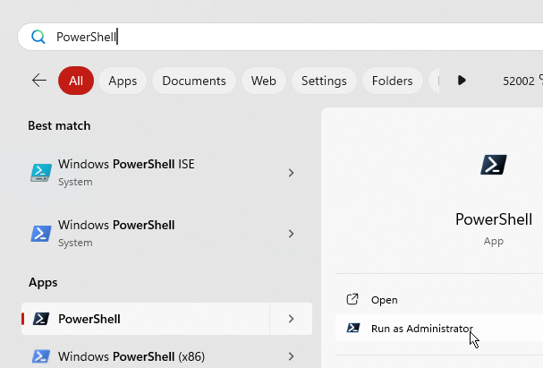

# Improving Performance of Embroidery Collection Manager

## Steps to making this script run faster

- Install Powershell 7
- Install the PSAuthClient module

## Install Powershell 7

Read the Microsoft provided documentation 
https://learn.microsoft.com/en-us/powershell/scripting/install/installing-powershell-on-windows?view=powershell-7.4


run `powershell` and type the command
```
winget install Microsoft.PowerShell

```

## Install the PSAuthClient module

Only if you are using the MySewnet cloud functionality do you need to install this module, but if you do it will make the startup of the process quicker.
Run `powershell` or `PWSH` after installing Powershell 7 *as administrator* and type the command
```
install-module PSAuthClient -Scope AllUsers


```

If you do not do this as an administrator then you will get the error message.

```
install-module : Administrator rights are required to install modules in 'C:\Program Files\WindowsPowerShell\Modules'.
Log on to the computer with an account that has Administrator rights, and then try again, or install
```

## Runas Administrator
