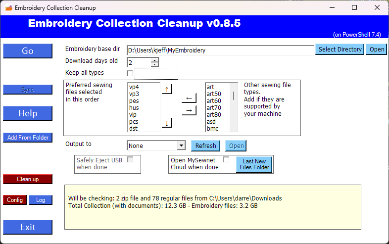
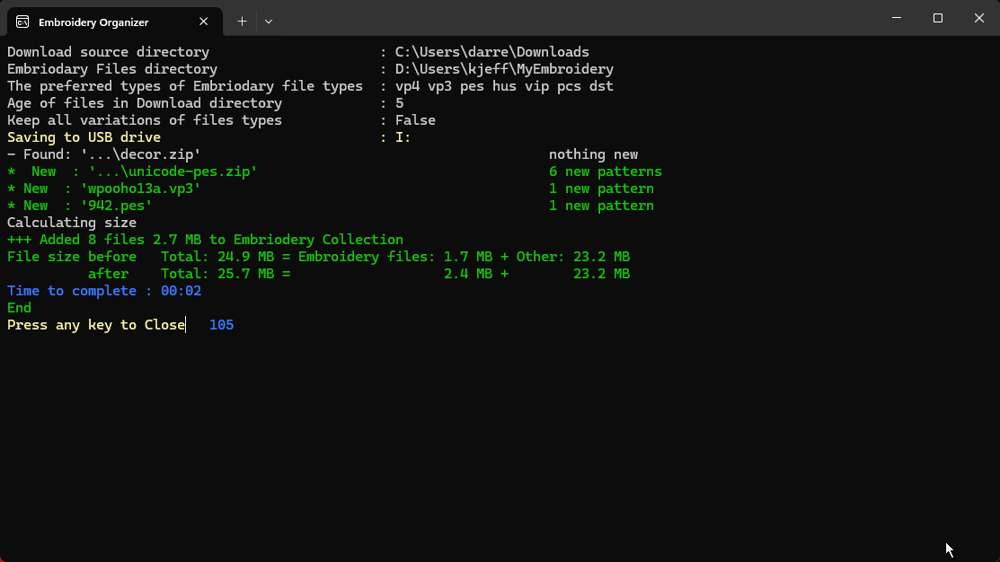
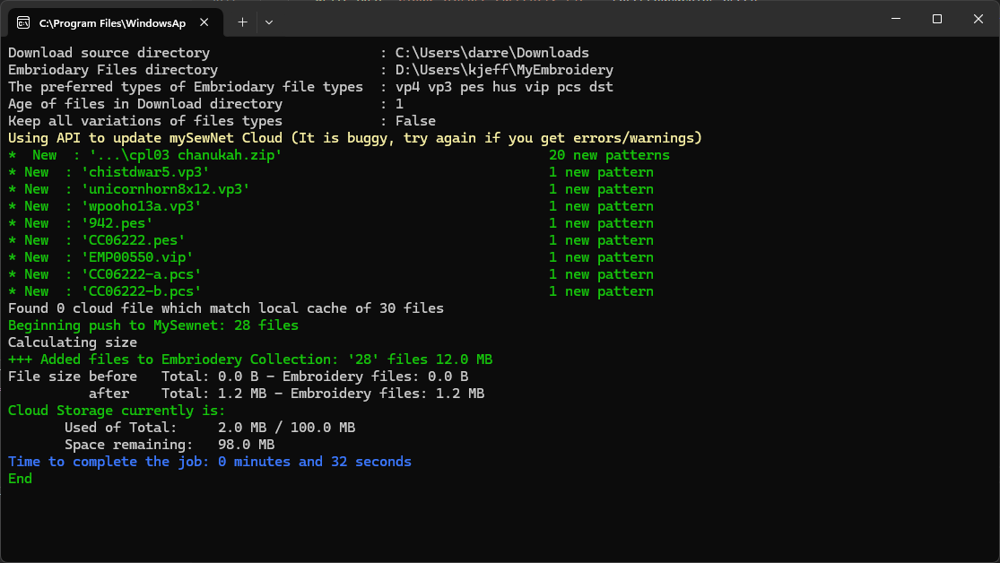

# EmbroideryCollection-Cleanup.ps1
## Who is this for?
Anyone who has an Embroidery machine (`Pfaff`, `Viking`, `Husqvarna`, `Janome`, `Brother`, `Baby Lock`, `Bernette`, `Singer`, `Jana`, `Brother` and many others) and are downloading files you purchased but are frustrated by the effort.
- Pull the files out of the zip file
- Figure out which type works on your machine
- Find the instructions and put them somewhere
- Looking through the sub-directories or zip file inside of a zip file
- Copy them to the place you need them to work

It will work with at least 3 different options:
- USB stick or
- Send to [mySewnet™ Cloud](https://mysewnet.com/) or
- Put the files into a folder to be dealt with (such as Send to Machine software - [Brother](https://help.brother-usa.com/app/answers/detail/a_id/158016/~/wirelessly-transfer-a-design-to-the-machine) or [MySewnet](https://softwarehelp.mysewnet.com/MSW/100/StitchEditor/index.html?#t=Topics%2FSending_to_a_Machine_via_Direct_USB_Connection.htm)).

All while keeping a copy of patterns on your computer for reference along with the instructions.  It uses the zip files names for the folder names it creates.

## Make it work
Once you have downloaded your embroidery files, click on the `icon for EmbroideryCollection-Cleanup` . This will start the process of scanning your download folder and moving any sewing files to the Embroidery folder on your computer, using the zip file names to create folder names.

Whether you're using a USB stick or MySewnet Cloud to transfer the files, the script will identify the compatible files for your embroidery machine and either copy them to the USB stick or upload them to the cloud (without wasting space). It will also separate the instructions, keeping them on your computer with the embroidery files, but not duplicating them on the USB stick or cloud.

By doing this, it minimizes nested folders while maintaining some organization in your files. This makes it much easier to find and use your patterns.

## How to Install Simple (Automatic)

*This working on Windows computers (it would work on a Apple MAC or Linux but have Windows specific extensions, [can a MAC run Powershell](https://learn.microsoft.com/en-us/powershell/scripting/install/installing-powershell-on-macos?view=powershell-7.4)?)*

Click `start` -> `Run` -> `Powershell`
In the windows that appears cut and paste the following 2 lines

```
$ScriptFromGitHub = Invoke-WebRequest https://raw.githubusercontent.com/D-Jeffrey/Embroidery-File-Organize/main/install.ps1
Invoke-Expression $($ScriptFromGitHub.Content)

```
### Important Note
It's generally *not advisable to run random code from the Internet*. However, this script is hosted publicly on GitHub, so it can be inspected for security issues. If you have an IT security expert, have them review it before you proceed.

#### Installation
To install the script, simply paste the two lines of code provided above and answer the setup installation questions.

After running the installation, you will find a desktop icon  for the script. During the initial setup, you'll be prompted to configure your preferences. The script will then use the selected folder to organize your 'Embroidery Collection' on your computer.  Use a new folder and it will copy all the files into that folder. The script and any related files will be installed in `c:\programdata\EmbroideryOrganize\`.

[See Help](help.md) for more instructions on using the program.

### Control Panel

### Output of processing - USB

### Output of processing - Cloud


## Why?
Why would I build a massive, long PowerShell to move a file a few files around?  So, this was created to help my wife manage the many embroidery files that she downloads from online stores and move them on to her Pfaff Creative Icon Embroidery machine.  My wife loves making crafts, but working on the computer isn't her thing. I got fed up with having to extract files whenever she bought patterns. Sometimes, she would even lose purchased or free patterns she downloaded because she didn't remember where she saved them or to extract them. I like to optimize and write some code adnd the machine includes the capability to synchronize those files that you download from the cloud my MySewnet.  When you buy embroidery files it usually comes with many different types plus the PDF of instructions all as part of a zip file. 
Now the challenge is that that zip file has a lot of junk in it that you don't need to be sent to MySewnet and it is limited to 100 megabytes unless you want to pay for the subscription service. 
So unzip the files, find the ones that you really need to keep, separate the instruction files out from the embroidery files, transfer the right ones on to the cloud and therefore the sewing machine, easy peasy.  I chose to use PowerShell so that people did not have to deal with downloading Python.  It is in one file to minimize complications for downloading and installed it. Simplifying so that people can get up and running is in a minimal number of clicks .. *easy peasy* .. **NOT** so much for me.. *but hopefully for other users*.

That is was where this started.  Originally, she could only keep about 40 downloads on her 'cloud storage space' on MySewnet.  Add to that the bugs in the web interface and limit of uploading/deleting 5 files at a time.  Compare that to this script which is easy for this script to have over a thousand files in the 100 MB space.  (Since most of the space would be for the diagram and instructions, and extra duplicate files of different types.)

A PowerShell script to deal with the many different types of embroidery files, put the right format types in [mySewnet™](https://mysewnet.com/) or onto your USB stick.  If you take look at the zip files you purchased full Embroidery patterns, it will come with many different types of files, along with PDF and JPG instructions.  That's all well and nice but only give you 100 megabytes to put all your files into, so why would you want to waste it with instructions. This script strips it down to the that are appropriate to sync onto my sewing net and get rid of the spread of the folder structures that comes along with it.  It is great that the creator of file images produces so many variations, but you only need one type of make your machine work.

Once it is set up with a shortcut you can simply download your patterns from online stores and then double-click the shortcut to copy the **right patterns** into your collection location and leave the instructions, along with the right file on your computer for reference later.

If you have stopped using your embroidery machine because the file extraction process was so frustrating it mades you cry, then this is for you. You just inserts your USB stick, click on the program, select Go, and can easily transfer the patterns to her machine.

## Getting started Manually (if you did not use the Automatic setup above)
This is a self-contained single PowerShell script (See note below).  It can be run by right clicking after downloading and select Run with PowerShell.  Windows may prompt if you want to allow PowerShell to run.  You may also have to `unblock` the downloaded file (`Right-click` properties of the file and at the bottom check the `unblock`.  Once you have copy the script into a location (suggested `c:\ProgramData\EmbroideryOrganize`)  (and unblocked), then you can run the script with -setup

```
    powershell .\EmbroideryCollection-Cleanup.ps1 -setup

    powershell .\EmbroideryCollection-Cleanup.ps1
    
```
Once you have run it once, it will create a EmbroideryCollection.CFG file in the same folder as the script, which you can edit to adjust the settings (and/or you can use command line parameters to change the settings).  It will also a file `EmbroideryCollection.Log` for any of its actions.


## Functions

Checks the download folder for the Embroidery files types of any age and all the zip files which have been downloaded in *DownloadDaysOld*.  Any Embroidery files found are copied in to the Mysewing cloud folder under *EmbrodRootDirtop* folder (set below). Any zip files found are scanned to see if they have Embroidery file types that we are interested in.  If they are files which do not yet exist in the mysewingnet cloud, then extract that zip to a temporary location, pull out all the relevant files (formats we want) with the folder hierachy (adjusted).  Also pull out any related documentation and put it with pattern files on the computer (not onto the USB or Cloud).

### folder Hierarchy (Adjusted)
When vendors build zip files and put them in all the different formats, it means digging for files.  The adjusted version of this will get rid of sub folders if they exist above and there are only folders in folders.  Example, if you have files in L3 inside of L2, inside of L1, then it will remove L1, L2, L3 and leave you the files.  If you have folders along with instructions with different folders to hold instructions, then it will not flatten the directories.  It used the parameter from the config file to remove unnessary files.  For example if the creator has a folder for HUS, and a folder for DST, then it will remove that folder and move all the files from it up one folder level.

## Requirements

It was orginally designed to work with [mySewnet™ Cloud](https://cloud.mysewnet.com/) which is a type of file share service for sewing machines.  It can also be used with USB Drives or Send file to functions.  If Mysewnet is used you will see a login page (if it does not fully load, please login to mysewnet from a reguler web browser page first and then run the script again)

Depending on the types Embroidery file extensions your machine uses, then you may what to change the sewing file types of for your machine.  Order matters, if will find the first one in your list of types and try and keep files of that type over the other types.  Use the GUI interface to reorder and add/remove files which work with your specific machine. 

  - **[Other docs](docs/)**

#### Seperating the files
When it is comparing patterns it uses the file name to determine if they are the same name.  It is case-sensitive and the files must be created on the same day.
`CleanCollection` will clean up files regardless of filename case if you run it, (it will prompt before deleting them).   **Use this option carefully, it is one of the few options that will remove files that it did not nessarily create.**

### Other good to knows
They also make the Explorer Plug-in which appears as a right click in File Explorer.  (**Great**, so obviously they have not tried this out in Windows 11, because W11 hides that in the classic functionality.)  This is [MySewnet Embroidery Software](https://softwarehelp.mysewnet.com/MSW/140/Configure/#t=Topics%2FUsing_the_Explorer_Plugin.htm)  Be aware that if you keep your repository in OneDrive the rendering of the pattern as an Icon does not work as of Apr 2024.  It appears that v1.5 is the current version (as of Dec 2024): https://www.mysewnet.com/en-us/embroidery/download-software.  Look for the the Download Explorer-Plug-In link. 


# Issues/Future
- If is processed as a group of separate zip files which have the same file in different patterns, it will choose a different preferred type than desired
- does not support onefolder deep switch yet
- needs more refactoring
- Cloud push is dependent on unique files names. **MAJOR limitation** I have not been using this, so have not spent time fixing the issue.  If you are looking to use this feature, please log an issue and I will prioritize it
- Should set the File Explorer 'Folder View', when a new folder is created, if the add-in in place to `Large` or `Huge` Icon view
- refactoring to use class to address some issues above

# Releases
### 0.8.6
- Detect Zip in zip even if no embroidery files are in parent zip
- hide Remove-Item progress
### 0.8.5
- Improved: Added Precount to indicate how may items will be processed, Async startup Optimization & speed up of processing
- Fix: Powershell 5.1 does not support  USBEject function & zipfile issue, cleanup of new space, open new files
### 0.8.4
- Improved `Add From Folder` button added
- Faster GUI start
- Upgrade is accessed by GUI (Features are shown each week or more as text)
- Improved presentation of Cleanup Files 
### 0.8.3
- Improved progress bars, Improve GUI layout, Fixed folder rollup, Improved/fixed USB eject
- Bug in calling the upgrade function
  - To overcome a bug for calling of install script.  If your upgrade from 0.8.2 fails.  You will need to manually do 
  - Start -> Run `powershell -ExecutionPolicy bypass -file C:\ProgramData\EmbroideryOrganize\install.ps1`
### 0.8.2
- Fixed warning on USB, close on click on X, Progress bars, delete empty folders on USB
- Optimized and fixed Clean Collection, fixed move lone directory and lone files.  It now works reliablity 
- Update now shows differences since the running release
### 0.8.1
- GUI Refinements, USB state detection
- Fixed Clean Collection and Sync
- Add buttons Clean up, Log, Config
### 0.8.0
- GUI Interface
- Add space available check to Sync to USB
- Fixed ShowExample to work with adjusted Github security
- Adjusted detection of mySewnet plug installation
### 0.7.1
- Add detection of empty USB for `Sync` recommendation and `eCollection.txt` marker. Detects if the USB is blank (maybe got formatted and offers to use Sync mode to catch back up)
- Added USBEject to Safely disconnect the USB Drive when the process is done
- Added Setup option easier to trigger while running normally
### 0.7.0
- Major rewrite to shift to Class based.
### 0.6.8
- Added USB `-Sync`
- Improved README
- fixed issue with lone files in download folder
### 0.6.7
- changed the iteration and tracking of temporary files to speed up the process
- support unicode file name by removing Diacritics
- Shortcut will now using PWSH if it is present (`-setup` will trigger an upgrade)
### 0.6.6
- Added option question for Firstrun when setup
...
### 0.6.5
- Another Major update
- Supports many nested zip in zips
- Corrected issues with Clean up Collection de-duplication using on-demand filehash
- refactor the management of mysewingfiles and zip processing
- Caution cloud `-sync` depends on unique file names
### 0.6.4 / 0.6.3
...
### 0.6.0
- Added support OpenID using PSAuthClient
...
### 0.5.6
- dealing with nested zip (but not recursive zip)
- speed up extract if 7zip is available for zip over 100 MB for PS5
- copy a nest zip only if 2 deep
- added try/catch on reading zip to avoid corruption errors
- Added upgrade to latest release option (weekly checks)
...
### 0.5.3
- More testing and bug files - first public available
### 0.5.2
- interactive setup
### 0.5.1
- Major added Support for USB for people who do not have Mysewnet
### 0.5.0
- Major cloud add for MySewnet
### 0.2.0
- Major re-write of code
- Add Configiration Options file saving
- Change suggesting top location to new location outside of OneDrive
- Support for USB drives
...
### 0.1.3
- Add Example to show how to use Send Via Add-in
- Keeps the previous 'New files' if there is nothing new to add
- automatically open web page if the plug in not installed
- Added History Logging of when a file was added
- Add setup to add Icon to desktop, create folders
...
### 0.1.2
- Added Support for Zip inside of Zip
### 0.0.1
- It has been in use for over a year, good base, but only ever been used by one person
