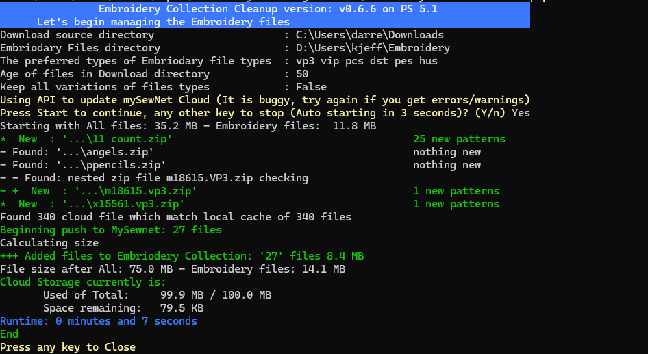

# EmbroideryCollection-Cleanup.ps1
## Who is this for?
Anyone who has an Embroidery machine (Pfaff, Viking, Husqvarna, Janome, Brother, Baby Lock, Bernette and many others) and is 
wanting to manage all the files that you have purchased and downloaded and get them onto your machine either by MySewnet or on a USB.

## Make it work
Once you have download your embroidery files click on the `icon for EmbroideryCollection-Cleanup` and it will look through the download folder and place any downloaded sewing files into the Embroidery folder on your computer.  Depending on if you are using a USB to transfer the files or using MySewnet Cloud, the script will look at the recently
downloaded files and find the ones that work for your Embroidery machine and put them onto the USB stick or push them up the cloud (without wasting space).  And it will separate out the instructions and the instructions on your computer with the embroidery files, but not duplicate them to the USB or cloud.  In the process, it will limit the number of folders in folders, while still bringing some organization to the files.

## How to Install Simple

*This working on Windows computers (not sure if it will work on a Apple Mac or Linux, [can a MAC run Powershell](https://learn.microsoft.com/en-us/powershell/scripting/install/installing-powershell-on-macos?view=powershell-7.4)?)*

Click `start` -> `Run` -> `Powershell`
In the windows that appears cut and paste the follow 2 lines

```
$ScriptFromGitHub = Invoke-WebRequest https://raw.githubusercontent.com/D-Jeffrey/Embroidery-File-Organize/main/install.ps1
Invoke-Expression $($ScriptFromGitHub.Content)

```

I will say, this is generally a bad idea to run random code from the Internet, but in this case, it is hosted in public view on Github and can be checked for Security issues.
If you know a security guy, have them take a look.  Then paste in the two lines and have this *package of care* installed.  See below for the manual install steps.

After running the installation, you should have a desktop icon  for the script.  It will also create a folder in Document called 'Embroidery' where the embroidery files on your computer are kept and will be organized.  By default, the script (and associated files) is installed in `c:\programdata\EmbroideryOrganize\`

## Why?
Why would I build a massive, long PowerShell to move a file a few files around?  So, this was created to help my wife manage the many embroidery files that she downloads from online stores and move them on to her Pfaff sewing machine. 
So the sewing machine includes the capability to synchronize those files that you download from the cloud my MySewnet.  When you buy embroidery files it usually comes with many different types plus the PDF of instructions all as part of a zip file. 
Now the challenge is that that zip file has a lot of junk in it that you don't need to be sent to MySewnet and it is limited to 100 megabytes unless you want to pay for the subscription service. 
So unzip the files, find the ones that you really need to keep, separate the instruction files out from the embroidery files, transfer the right ones on to the cloud and therefore the sewing machine, easy peasy.  I chose to use PowerShell so that people did not have to deal with downloading Python.  Simplifying so that people can get up and running is in a minimal number of clicks .. easy peasy .. NOT so much for me.. *but hopefully for users*.

That is what this is.  Originally, she could only keep about 40 downloads on her 'storage space' on MySewnet.  Lately it has gotten much harder with the bugs in the web interface and limit of uploading 5 files at a time.

A PowerShell script to deal with the many different types of embroidery files, put the right format types in [mySewnet™](https://mysewnet.com/).  If you take all the zip files when you purchase Embroidery patterns, it will come with many different types, along with PDF and Word docs examining how to use the pattern.  That's all well and nice but only give you 100 megabytes to put all your files into, so why would you want to waste it with instructions. This script strips it down to the that are appropriate to sync onto my sewing net and get spread of a lot of the folder structure that comes along with it.  It is great that the creator of file images produces so many variations, but you only need one type of make your machine work.

Once it is set up with a shortcut you can simply download your patterns from online stores and then double-click the shortcut to copy the **right patterns** into your collection location and leave the instructions on your computer for reference later.


## Getting started
This is a self-contained single PowerShell script (See note below).  It can be run by right clicking after downloading and select Run with PowerShell.  Windows may prompt if you want to allow PowerShell to run.  You may also have to `unblock` the downloaded file (`Right-click` properties of the file and at the bottom check the `unblock`.  Once you have copy the script into a location (suggested `c:\ProgramData\EmbroideryOrganize`)  (and unblocked), then you can run the script with -setup

```
    powershell .\EmbroideryCollection-Cleanup.ps1 -setup

    powershell .\EmbroideryCollection-Cleanup.ps1
    
```
Once you have run it once, it will create a EmbroideryCollection.CFG file in the same directory as the script, which you can edit to adjust the settings (and/or you can use command line parameters to change the settings).  It will also a file `EmbroideryCollection.Log` for any of its actions.

If you want to push your files into MySewnet, then you will need one additional module [`PSAutheClient`](https://github.com/alflokken/PSAuthClient) from [`alflokken`](https://github.com/alflokken)

## WIP All these have changed - Parameters
- `-Setup`    Interactive setup of parameters, create the directories required, and create a shortcut on the Desktop Icon linked to this PowerShell script.
- `-EmbroidDir documents\Embroidery` The local cache of embroidery files and instructions.
- `-CleanCollection`  This is two steps: 1) clean out non preferred embroidery files and duplicates from the the local cache.  2) look for duplicates regardless of if there they are in different directory structure if they have the same name and are created on the same day.  It will show a list and promopt before deleting.  The files are deleted to the **recycle bin** so they can be restored. (use `-HardDelete` to delete without recycling)
- `-DownloadDaysOld 7` ▫  determine how old of zip files to look for (in days) 
- `-KeepAllTypes` ◊ Keep all of the preferred types of pattern files (rather than only the top preferred)
- `-SetSize 10` ▫     When this many files are found together, it will keep the files together in a directory using the zip file name
- `-KeepAllTypes` ◊  Keep all types of a file (duplicate name but different extensions), normally this will find your most preferred file type and only keep that one.  See preferredSewType below.
- `-DragUpload` ◊  Use the web page instead of the plug in to drag and drop
- `-Testing`  Run it without it doing actual copying of files or cleaning up.
- `-ShowExample` ◊  Show the example GIF on how to send files to the cloud (different image for Windows 10 vs Windows 11)
- `-USBDrive I:` ▫  Copy the new files to a specified USB drive (in the form of I: or H: or E:).  To Disable USB use 'OFF' for the drive letter
- `-ConfigFile EmbroideryCollection.cfg` The name of the configuration file which is in the same directory as the script itself.  The options selected are saved into the configuration file so the next time the script is run the same settings stay in effect.
- `-ConfigDefault` Reset the default settings and options to original default any of the ◊ or ▫ marked options
- `-SwitchDefault` Use to turn off the Switches you might have turned on - Any of the ◊ marked options (this is the only command-line way to reset the options because of the config file saving the settings state)
- `-CloudAPI` Use MySewNet Cloud to save file after they have been added to the local computer cache  (Either USBDrive or CloudAPI but not both at the same time).  Only preferred embroidery types will be uploaded to the cloud.
- `-Sync` Syncronize the files in the local `EmbroidDir` cache to the Mysewnet Cloud cache.  This includes creating folders and removing files if they are removed from the local cache.  This will only copy the preferred embroidery types to the cloud.

### Future
- `-OneDirectory` Only put files one folder deep.
- `-NoDirectory` Put files the root directory only.
- `-Sync` If using USB synchronized the files will copy to the local USB

## Functions

Checks the download directory for the Embroidery files types of any age and all the zip files which have been downloaded in *DownloadDaysOld*.  
Any Embroidery files found are copied in to the Mysewing cloud folder under *EmbrodRootDirtop* directory (set below).
Any zip files found are scanned to see if they have Embroidery file types that we are interested in.  If they are files which do not yet exist in the
mysewingnet cloud, then extract that zip to a temporary location, pull out all the relevant files (formats we want) with the directory hierachy (adjusted).  Also pull out any related documentation and put it into the *instructions* folder within the user documents on the computer with the directory hierarchy (adjusted).
**TODO** add a get other types of function

### Directory Hierarchy (Adjusted)
When vendors build zip files and put them in all the different formats, it means digging for files.  The adjusted version of this will get rid of sub folders if they exist above and there are only folders in folders.  Example, if you have files in L3 inside of L2, inside of L1, then it will remove L1, L2, L3 and leave you the files.  If you have folders along with instructions with different folders to hold instructions, then it will not flatten the directories.

## Requirements

It was designed to work with [mySewnet™ Cloud](https://cloud.mysewnet.com/) which is a type of file share service for sewing machines.  It can also be used.

`$EmbrodRootDirtop = "Embroidery"` is the directory name within your MySewnet cloud that this program will put all the files and clean our file types that do not match the type you set.  It must exist in in the root directory of the **mySewnet cloud folders**, order for the program to run.
`$instructions = "Embroidery Instructions"`  this is where all the instructions are saved (outside of MySewnet).  It must exist within the users **Documents** folder in order for the program to run.

Depending on the types Embroidery file extensions your machine uses, then you may what to change the sewing file types of for your machine.  Order matters, if will find the first one in your list of types and try and keep files of that type over the other types.
`$preferredSewType = ('vp3', 'vp4')`

## Action


### Nice to know

If you have 7zip installed on your computer, (that native version, not MS store version), then it will be used when working with large zip files as it is much faster.
If will create folder when there is a number of files `-aSetSizeis` that are in a given zip file using the name of the zip file.  You most likely will want to rename it and give it a new name which reflects the folder.
Ignore files which are terms and conditions (it does not mean you can ignore the laws, just don't save so many copies of the files.
`$TandCs = @('TERMS-OF-USAGE.*', 'planetappliquetermsandconditions.*')`  Edit your config (EmbroideryCollection.cfg) file to adjust these values. 
This are the directories (plus the if the directory name equals the format type)  
`$foldupDir = @('images','sewing helps','Designs', 'Design Files')` Edit your config file.

 - **[How to install](docs/How-to-Install.md)**
 - **[Other docs](docs/)**

#### Seperating the files
When it is comparing patterns it uses the file name to determine if they are the same name.  It is case-sensitive and the files must be created on the same day.
`CleanCollection` will clean up files regardless of filename case if you run it, (it will prompt before deleting them)

### Updated to remove Cloud Sync functionality
The myCloud interface is painful to use, as it has bugs such as sorting directories, and only allows you to upload or delete 5 folders/files at a time.  Crazy.  And now they are pushing customers to use the Vault function instead of the myCloud. Vault will only accept pattern files that it understands, so you cannot keep the instructions with the patterns.  I suspect it is in response to the possible misuse of the cloud space they have created.

They also make the Explorer Plug-in which appears as a right click in File Explorer.  (**Great**, so obviously they have not tried this out in Windows 11, because W11 hides that in the classic functionality.)  This is [MySewnet Embroidery Software](https://softwarehelp.mysewnet.com/MSW/140/Configure/#t=Topics%2FUsing_the_Explorer_Plugin.htm)  Be aware that if you keep your repository in OneDrive the rendering of the pattern as an Icon does not work.

It appears that v1.5 is the current version (as of Mar 2024): https://www.mysewnet.com/en-us/embroidery/download-software.  

### back to the regularly scheduled instructions which are only partly applicable....

# Issues/Future
- If is processed as a group of separate zip files which have the same file in different patterns, it will choose a different preferred type than desired
- does not support onedirectory deep switch yet
- sync should work with USB as well as cloud
- does not warn if cloud will exceed limits with the latest push
- need more refactoring
- some interactive setup options should have other choices before deciding.
- Cloud push is depend on unique files names.
- Should set the File Explorer Folder View when a new folder is created if the add-in in place to Large or Huge Icon view
- Need to work on Duplicate files of the same name by different file types

# Releases
### 0.6.7
- changed the iteration and tracking of temporary files to speed up the process
- support unicode file name by removing Diacritics
- Shortcut will now using PWSH if it is present (`-setup` will trigger an upgrade)
### 0.6.6
- fixed issues with starting with no files
- working on performance
- Added option question for Firstrun when setup
### 0.6.5
- Update Documentation
- Another Major update
- Supports many nested zip in zips
- Corrected issues with Clean up Collection de-duplication using on-demand filehash
- refactor the management of mysewingfiles and zip processing
- Caution cloud `-sync` depends on unique file names
### 0.6.4 / 0.6.3
- bug files to land in the right directory and error catching
### 0.6.2
- Added Logging and remove extra debug code
- Fixed saving parameters via JSON for difference between PS 5,6 vs 7
- fix issue with nest cloud folders add/removing of files and empty folders
### 0.6.0
- Added support OpenID using PSAuthClient
- remove user/pw need and caching
- fixed sync moving of files in the cloud
- addressed install script issues
### 0.5.6
- dealing with nested zip (but not recursive zip)
- fixed duplicate files issues
- speed up extract if 7zip is available for zip over 100 MB
- add more foldupDir values
- fixed up clean up, added pop-up of files it will clean
- copy a nest zip only if 2 deep
- added try/catch on reading zip to avoid corruption errors
- Added upgrade to latest release option (weekly checks)
### 0.5.3
- More testing and bug files - first public available
### 0.5.2
- interactive setup
### 0.5.1
- Major added Support for USB for people who do not have Mysewnet
### 0.5.0
- Major cloud add for MySewnet
### 0.4.0
- Refactoring
### 0.3.0
- Simple cloud functions
### 0.2.0
- Major re-write of code
- Add Configiration Options file saving
- Added new options including SkipExample, NoDirectory
- Change suggested top location to new location outside of OneDrive
- Support for USB drives
- lots of bugs fixed
### 0.1.4
- Started work on using API
- Smaller how to image example
- Fixed nested folders not copying to new upload directory
### 0.1.3
- Add Example to show how to use Send Via Add-in
- Keeps the previous 'New files' if there is nothing new to add
- automatically open web page if the plug in not installed
- Added History Logging of when a file was added
- Add setup to add Icon to desktop, create folders
- bug fix MyPause
- adjusted Setsize
### 0.1.2
- Added Support for Zip inside of Zip
### 0.0.2
- Fixed the script name, fixed error messages
### 0.0.1
- It has been in use for over a year, good based, but only every been used by one person
