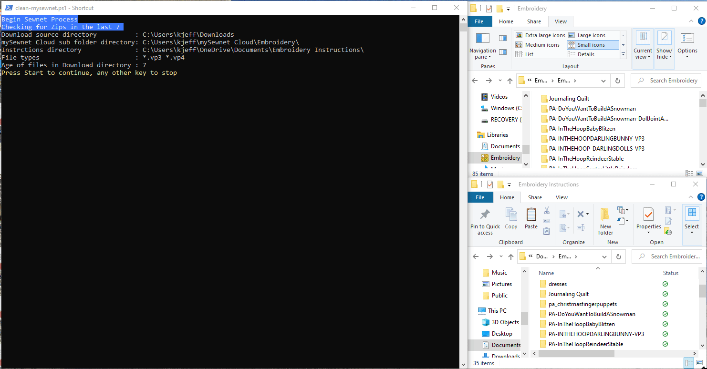

# MySewingNet-Cleanup
A powershell script to deal with the many different types of embroidery files, put the right format types in [mySewnet™](https://mysewnet.com/).  If you take all the zip files when you get purchase Embroidery patterns, it will come wiht many different types, along with PDF and Word docs exampling how to use the pattern.  That's all well and nice but only give you 100 megabytes to put all your files into, so why would you want to waste it with instructions. This script strips it down to the that are appropriate to sync onto my sewing net and get spread of a lot of the folder structure that comes along with it.  It is great that the creates of the file images produce so many variations, but you only need one type of make your mahine work.

## Getting started
This is a self contained powershell script.  It can be run by right clicking after downloading and select Run with PowerShell.  Windows may prompt if you want to allow running of powershell.  You may also have to unblock the downloaded file (Right-click promperties and at the bottom check the `unblock`.

## parameters
`-includeEmbFilesWithInstruction = $false` Put a copy of the Embrodery in with the instructions in addition to putting them into the mysewnet cloud folders
`-CleansewingNet = $false`  Clean out non embroidery files from the mysewingnet cloud directory since it is limited on the amount of space you have to work with (unless you are using the Silver or Platinum plans.  The files are deleted to the **recycle bin** so they can be restored.
`-DownloadDaysOld = 7`  determine how old of zip files to look for (in days) 

## functions

Checks the download directory for the Embrodery files types of any age and all the zip files which have been downloaded in *DownloadDaysOld*.  
Any Embrodery files found are copied in to the mysewing cloud folder under *treetop* directory (set below).
Any zip files found are scanned to see if they have Embrodery file types that we are interested in.  If they are files which do not yet exist in the
mysewingnet cloud, then extract that zip to a temporary location, pull out all the relevant files (formats we want) with the directory hierachy (adjusted).  Also pull out any related documentation and put it into the *instructions* folder location within the user documents on the computer with the directory hierachy (adjusted).
**TODO** add a get other types function

### Directory Hierachy (Adjusted)
When vendors build zip files and put in all the different formats, it means digging for files.  The adjusted version of this will get rid of sub folders if they exist above and there is only folders in folders.  Example, if you have files in L3 inside of L2, inside of L1, then it will remove L1, L2, L3 and leave you the files.  If you have folders along with instructions with different folders to hold instructions, then it will not flatten the directories.

## requirements

It was designed to work with [mySewnet™ Cloud](https://cloud.mysewnet.com/) which is a type of file share service for sewing machines.

`$treetop = "Embroidery"` is the directory name within your mysewingnet cloud that this program will put all the files and clean our file types that do not match the type you set.  It must exist in in the root directory of the **mySewnet cloud folders**, order for the program to run.
`$instructions = "Embroidery Instructions"`  this is where all the instructions are saved (outside of mysewingnet).  It must exist within the users **Documents** folder in order for the program to run

Depending on the types Embrodery file extensions your machine uses then you may what to change the sewing file types of for you machine.
`$mysewtypes = ('vp3', 'vp4')`

### nice to know

Ignore files which are terms and conditions (it does not mean you can ignore the laws, just don't save so many copies of the files.
`$TCs = @('TERMS-OF-USAGE.*', 'planetappliquetermsandconditions.*')`
This are the directories (plus the if the directory name equals the format type)
`$rollup = @('images','sewing helps')`

## Buggy software 
*I can not be believe that that they ask people to pay to use this crappy service*
I have spent the last 8 hours rebuilding my wife MySewnet folders. After the combination of the web page and sync client wiped out 95% of the files.

So the Pfaff version of the client on my wife's machine works okay.  (It has lots of sync issues where it needs to time0out while syncing files, I assume that is caused by the number of session that it has running concurrently and not process some REST error messages)

The mySewnet Windows sync client software is extremely buggy.  As well, as the web pages ae extremely buggy.  I have no idea who tested this, but they certainly did not do any volume testing or a number of folders.
- On the web page, when you select multiple items (using the checkbox by the Name) and you have several hundred items, it may indicate that you have selected the items, but not actually check the boxes.  It will not show you that it may have selected folders and then when you delete, it's list of selected items which not match what is checked on the page.
- in the client if you move folders, depending on how many files and folders you have the client will not realize that you have move folders or files and assume they are added, then it will bring a copy of that file back from the cloud onto your computer. This maybe be a good way to mess up the customer and cause them to need to purchase more space in order to keep the unexpected growth under control.
- the sync client gets confused and started creating folders when it is looking at a file and then it gets into a loop repeatly trying to sync that folder.
- it has major issues with nested folders, if you create nested folder by copying a group of folders around, then the client may end up creating a flatten structure copy.
- several times, I have had all files disappear or get duplicated, which means keeping all the ZIP files sitting around, in casue you need to reload them.
- I guess the intent is to make you purchase from them, rather than 3rd parties they can put the files back into your cloud after it gets all messed up.
