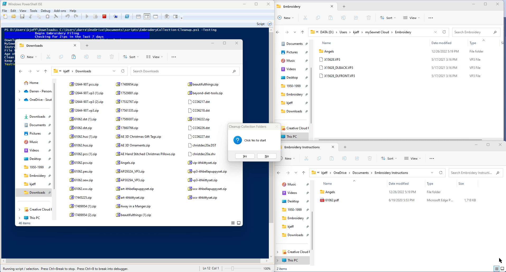

# EmbroderyCollection-Cleanup.ps1

A powershell script to deal with the many different types of embroidery files, put the right format types in [mySewnet™](https://mysewnet.com/).  If you take all the zip files when you get purchase Embroidery patterns, it will come with many different types, along with PDF and Word docs exampling how to use the pattern.  That's all well and nice but only give you 100 megabytes to put all your files into, so why would you want to waste it with instructions. This script strips it down to the that are appropriate to sync onto my sewing net and get spread of a lot of the folder structure that comes along with it.  It is great that the creates of the file images produce so many variations, but you only need one type of make your mahine work.

Once it is setup with a shortcut you can simply download your patterns from online stores and then double-click the shortcut to copy the **right patterns** into yuor collection location.

## Getting started
This is a self contained single powershell script.  It can be run by right clicking after downloading and select Run with PowerShell.  Windows may prompt if you want to allow running of powershell.  You may also have to unblock the downloaded file (Right-click properties of the file and at the bottom check the `unblock`.

## parameters
`-includeEmbFilesWithInstruction` Put a copy of the Embrodery in with the instructions in addition to putting them into the mySewnet™ cloud folders.  Not recommended
`-CleanCollection` or `-CleanCollectionIgnoreDir`  Clean out non embroidery files from the mySewnet™ cloud directory since it is limits on the amount of space you have to work with.  IgnoreDir will look for duplicates reguardless if there they are in different directory structure.  The files are deleted to the **recycle bin** so they can be restored. (use -$HardDelete to delete without recycle)
`-DownloadDaysOld = 7`  determine how old of zip files to look for (in days) 
`-Testing`  Run it without it doing actual copying of files or cleaning up.
`-KeepAllTypes` Keep all of the preferred types of pattern files (rather than only the top preferred)
`-$aSetSizeis

## Functions

Checks the download directory for the Embrodery files types of any age and all the zip files which have been downloaded in *DownloadDaysOld*.  
Any Embrodery files found are copied in to the Mysewing cloud folder under *EmbrodRootDirtop* directory (set below).
Any zip files found are scanned to see if they have Embrodery file types that we are interested in.  If they are files which do not yet exist in the
mysewingnet cloud, then extract that zip to a temporary location, pull out all the relevant files (formats we want) with the directory hierachy (adjusted).  Also pull out any related documentation and put it into the *instructions* folder location within the user documents on the computer with the directory hierachy (adjusted).
**TODO** add a get other types function

### Directory Hierachy (Adjusted)
When vendors build zip files and put in all the different formats, it means digging for files.  The adjusted version of this will get rid of sub folders if they exist above and there is only folders in folders.  Example, if you have files in L3 inside of L2, inside of L1, then it will remove L1, L2, L3 and leave you the files.  If you have folders along with instructions with different folders to hold instructions, then it will not flatten the directories.

## Requirements

It was designed to work with [mySewnet™ Cloud](https://cloud.mysewnet.com/) which is a type of file share service for sewing machines.

`$EmbrodRootDirtop = "Embroidery"` is the directory name within your mysewingnet cloud that this program will put all the files and clean our file types that do not match the type you set.  It must exist in in the root directory of the **mySewnet cloud folders**, order for the program to run.
`$instructions = "Embroidery Instructions"`  this is where all the instructions are saved (outside of mysewingnet).  It must exist within the users **Documents** folder in order for the program to run

Depending on the types Embrodery file extensions your machine uses then you may what to change the sewing file types of for you machine.  Order matter, if will find the first one in your list of types and try and keep files of that type over the other types.
`$preferredSewType = ('vp3', 'vp4')`

## Action

### Nice to know

If will create folder when there is a number of files `-aSetSizeis` that are in a given zip file using the name of the zip file.  You most likely will want to rename it and give it a new name which reflects the folder.
Ignore files which are terms and conditions (it does not mean you can ignore the laws, just don't save so many copies of the files.
`$TandCs = @('TERMS-OF-USAGE.*', 'planetappliquetermsandconditions.*')`
This are the directories (plus the if the directory name equals the format type)
`$foldupDir = @('images','sewing helps','Designs', 'Design Files')`

 - **[How to install](docs/How-to-Install.md)**
 - **[Other docs](docs/)**
