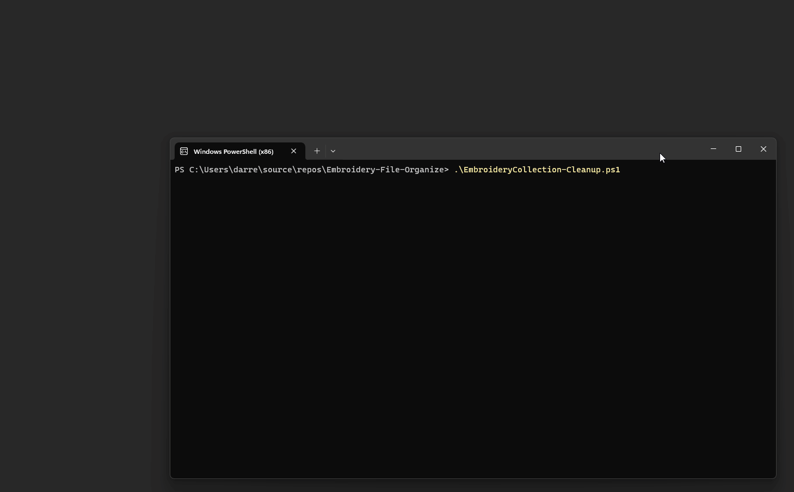

[![License][license-shield]][LICENSE]
![Project Maintenance][maintenance-shield]
[![GitHub Activity][commits-shield]][commits]
![GitHub Activity][releases-shield]

# EmbroideryCollection-Cleanup.ps1

## Why?
Why would I build a long powershell to move a file a few files around?  So this was created in order to help my wife manage the many embroidery files that she downloads from online stores moving them on to her pfaff sewing machine. 
So the sewing machine includes the capability to synchronize those files that you download from the cloud my MySewnet.  When you buy embroidery files it usually comes with many different types plus the PDF of instructions all as part of a zip file.
Now the challenge is that that zip file has a lot of junk in it that you don't need to be sent to MySewnet and it is limited to 100 megabytes unless you want to pay for the subscription service. 
So unzip the files, find the ones that you really need to keep, separate the instruction files out from the embroidery files, transfer the right ones on to the cloud and therefor the sewing machine, easy pessy.

That is what this is.  Originally she could only keep about 40 downloads on her space on MySewnet.

#### Updated to remove Cloud Sync functionality
It seems that the MySewnet Cloud Sync tool has been discontinued as of September 2023 and is no longer supported by MySewnet.  This is a major problem has this code depends on that to sync in the updating of the cloud. I'm going to see if I can discovery the interface for pushing files to the cloud and keep the functionality alive.

It has been superceded by the Explorer Plug-in which appears as a right click in File Explorer.  (**Great**, so obviously they have not tried this out in Windows 11, because W11 hides that in the classic functionality.)
This is [MySewnet Embroidery Software](https://softwarehelp.mysewnet.com/MSW/140/Configure/#t=Topics%2FUsing_the_Explorer_Plugin.htm)  


It appears that v1.5 is the current version: https://download.mysewnet.com/en/.  So the new approach is to sustatin the cached copy of Embroidary files locally on the computer and then pop a new Explorer directory with the new files found in the lastest download since it was last run.



This new approach is a little more work but opens up options for people who use USB connections to push files onto their machine.
.. instructions coming soon

#### more changes to come...

### back to the regularly scheduled instructions which are only partly applicable....
A powershell script to deal with the many different types of embroidery files, put the right format types in [mySewnet™](https://mysewnet.com/).  If you take all the zip files when you get purchase Embroidery patterns, it will come with many different types, along with PDF and Word docs exampling how to use the pattern.  That's all well and nice but only give you 100 megabytes to put all your files into, so why would you want to waste it with instructions. This script strips it down to the that are appropriate to sync onto my sewing net and get spread of a lot of the folder structure that comes along with it.  It is great that the creates of the file images produce so many variations, but you only need one type of make your mahine work.

Once it is setup with a shortcut you can simply download your patterns from online stores and then double-click the shortcut to copy the **right patterns** into yuor collection location.

## Getting started
This is a self contained single powershell script.  It can be run by right clicking after downloading and select Run with PowerShell.  Windows may prompt if you want to allow running of powershell.  You may also have to unblock the downloaded file (Right-click properties of the file and at the bottom check the `unblock`.  Once you have copy the script into a location you will keep referencing (and unblocked), then you can run the script with -setup

```
    powershell .\EmbroideryCollection-Cleanup.ps1 -setup

    powershell .\EmbroideryCollection-Cleanup.ps1
```


## parameters
- `-Setup`    Create the directories required, and create a shortcut on the Desktop Icon linked to this Powershell script.
- `-includeEmbFilesWithInstruction` Put a copy of the Embrodery in with the instructions in addition to putting them into the MySewnet™ cloud folders.  Not recommended
- `-CleanCollection` or `-CleanCollectionIgnoreDir`  Clean out non embroidery files from the MySewnet™ cloud directory since it is limits on the amount of space you have to work with.  IgnoreDir will look for duplicates reguardless if there they are in different directory structure.  The files are deleted to the **recycle bin** so they can be restored. (use `-HardDelete` to delete without recycle)
- `-DownloadDaysOld 7`    determine how old of zip files to look for (in days) 
- `-Testing`  Run it without it doing actual copying of files or cleaning up.
- `-KeepAllTypes` Keep all of the preferred types of pattern files (rather than only the top preferred)
- `-SetSize 10`     When this many files are found together, it will keep the files together in a directory using the zip file name

## Functions

Checks the download directory for the Embrodery files types of any age and all the zip files which have been downloaded in *DownloadDaysOld*.  
Any Embrodery files found are copied in to the Mysewing cloud folder under *EmbrodRootDirtop* directory (set below).
Any zip files found are scanned to see if they have Embrodery file types that we are interested in.  If they are files which do not yet exist in the
mysewingnet cloud, then extract that zip to a temporary location, pull out all the relevant files (formats we want) with the directory hierachy (adjusted).  Also pull out any related documentation and put it into the *instructions* folder location within the user documents on the computer with the directory hierachy (adjusted).
**TODO** add a get other types function

### Directory Hierachy (Adjusted)
When vendors build zip files and put in all the different formats, it means digging for files.  The adjusted version of this will get rid of sub folders if they exist above and there is only folders in folders.  Example, if you have files in L3 inside of L2, inside of L1, then it will remove L1, L2, L3 and leave you the files.  If you have folders along with instructions with different folders to hold instructions, then it will not flatten the directories.

## Requirements

It was designed to work with [mySewnet™ Cloud](https://cloud.mysewnet.com/) which is a type of file share service for sewing machines.  It can also be used

`$EmbrodRootDirtop = "Embroidery"` is the directory name within your MySewnet cloud that this program will put all the files and clean our file types that do not match the type you set.  It must exist in in the root directory of the **mySewnet cloud folders**, order for the program to run.
`$instructions = "Embroidery Instructions"`  this is where all the instructions are saved (outside of MySewnet).  It must exist within the users **Documents** folder in order for the program to run

Depending on the types Embrodery file extensions your machine uses then you may what to change the sewing file types of for you machine.  Order matter, if will find the first one in your list of types and try and keep files of that type over the other types.
`$preferredSewType = ('vp3', 'vp4')`

## Action


### Nice to know

If will create folder when there is a number of files `-aSetSizeis` that are in a given zip file using the name of the zip file.  You most likely will want to rename it and give it a new name which reflects the folder.
Ignore files which are terms and conditions (it does not mean you can ignore the laws, just don't save so many copies of the files.
`$TandCs = @('TERMS-OF-USAGE.*', 'planetappliquetermsandconditions.*')`
This are the directories (plus the if the directory name equals the format type)
`$foldupDir = @('images','sewing helps','Designs', 'Design Files')`

 - **[How to install](docs/How-to-Install.md)**
 - **[Other docs](docs/)**

## Issues/Future
- Needs a GUI interface for the general user to configure and use. (Some progress is underway)
- Needs to support USB for people who are not MySewnet based.
- Should have a Settings .ini file and keep values in that config
  - allow for switch between MySewnet and automatic update of a USB stick
  - keep DownloadDaysOld & SetSizeis 
  - keep new directory 
  - keep preferredSewType 
- Reverse-engineer the API to query for the contents in the cloud

## Releases
### 0.1.3
- Add Example to show how to use Send Via Add-in
- Keeps the previous 'New files' if there is nothing new to add
- automatically open web page if the plug in not installed
- Added History Logging of when a file was added
- Add setup to add Icon to desktop, create folders
- bug fix MyPause
- adjusted Setsize
- 
### 0.1.2
- Added Support for Zip inside of Zip
- Adjust the code to start to deal with the end-of-life for the MySewnet Cloud Sync tool.
- Improved some logging
- It does require more manual effort to send the file results to the cloud.
- It still managed the local repository of files but it create a temporary new location for any recent downloads.
- This may actually work better for people who did not use Cloud Sync or have Cloud Sync support but did use Direct USB

### 0.0.2
- Fixed the script name, fixed error messages
### 0.0.1
- It has been in use for over a year, good based, but only every been used by one person


[license-shield]: https://img.shields.io/github/license/D-Jeffrey/Embroidery-File-Organize.svg?style=for-the-badge
[license]: LICENSE
[commits]: https://github.com/D-Jeffrey/Embroidery-File-Organize/commits
[commits-shield]: https://img.shields.io/github/commit-activity/y/D-Jeffrey/Embroidery-File-Organize?style=for-the-badge
[maintenance-shield]: https://img.shields.io/maintenance/yes/2023.svg?style=for-the-badge
[releases-shield]: https://img.shields.io/github/v/release/D-Jeffrey/Embroidery-File-Organize.svg?style=for-the-badge
