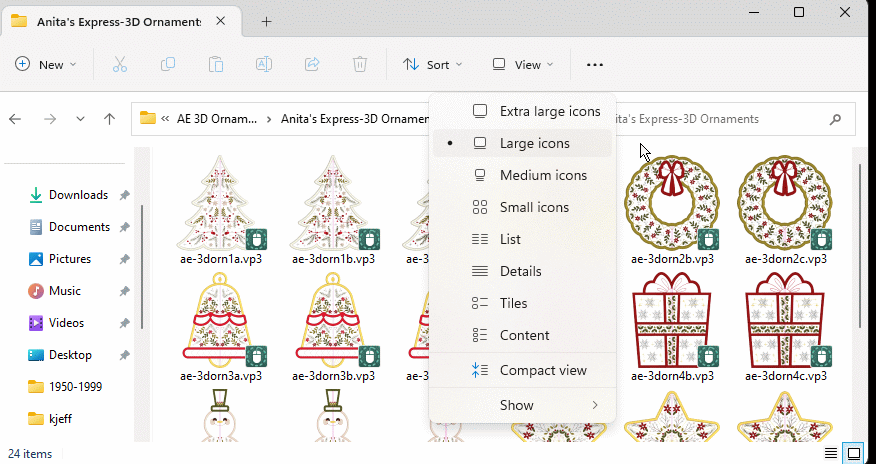

# If you have MySewnet Cloud
1. First download the script (select the green Code button and choose Download ZIP).  Open the Zip and save the file `EmbroderyCollection-Cleanup.ps1` it to a a folder like **Documents** `scripts`
2. Select the file and select the Properties click on unblock
3. Next create a shortcut on your desktop with the command
  - For the location of the item put in something like `Powershell.exe -NoLogo -ExecutionPolicy Bypass -File "C:\Users\darre\OneDrive\Documents\scripts\EmbroderyCollection-Cleanup.ps1"`
  - For the name use something like` Embrodery Extractor`

3. Create a directory in **Documents** call `Embrodery Instructions`
4. If you have a lot of duplicate and extract files in your Mysewnet Cloud folder then create a folder in **Downloads** and move all the files into that folder.
  - Don't worry will put all the right files back in there for you
6. If you have Mysewnet Cloud, create a directory in there called `Embrodery`
  - or if you do not have Mysewnet Cloud and don't plan on using it create a folder in **Documents** call `Embrodery`
7. Edit the file and set the types of patterns that work best for you.
      `$preferredSewType = ('vp3', 'vp4')`
 - See [File Types](File-Types.md)
You should be ready to go now... run the program by clicking on the shortcut and watch the results..

Or run Powershell and at the command prompt using the commandline options such as:
```
PS>  cd C:\Users\darre\OneDrive\Documents\scripts\
PS>  EmbroderyCollection-Cleanup.ps1 -Testing
PS>  EmbroderyCollection-Cleanup.ps1 -?
PS>  EmbroderyCollection-Cleanup.ps1 -DownloadDaysOld 720

```

8. I also suggest you download and install **[MySewnet Embroidery Software](https://download.mysewnet.com/MSW/140/mySewnetEmbroidery_Win140.exe)** & **[Explorer Plug-in Software](https://download.mysewnet.com/MSW/140/mySewnetExplorerPlugin_Win140.exe)** from Mysewnet, thir thumbnail file preview feature is very well done.

