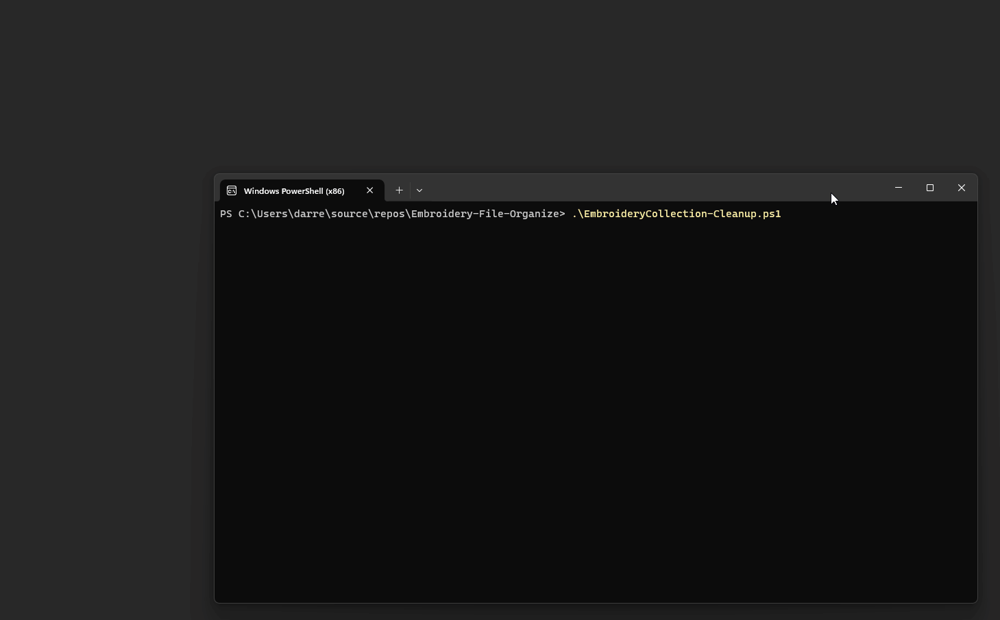
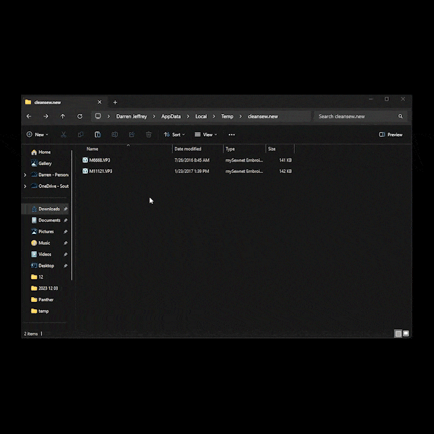

# EmbroideryCollection-Cleanup Help
---

## Using MySewnet
If you want to push your files into MySewnet, then you will need one additional module [`PSAutheClient`](https://github.com/alflokken/PSAuthClient) from [`alflokken`](https://github.com/alflokken)

## Command-line parameters

| Option | ↘ ◊ | Description
| ------ | ---|--------------- |
| `-Setup` | |  Interactive setup of parameters, create the directories required, and create a shortcut on the Desktop Icon linked to this PowerShell script.
|`-EmbroidDir` directory|↘  | The local cache of embroidery files and instructions.
|`-CleanCollection` | |This is two steps: 1) clean out non preferred embroidery files and duplicates from the the local cache.  2) look for duplicates regardless of if there they are in different directory structure if they have the same name and are created on the same day.  It will show a list and promopt before deleting.  The files are deleted to the **recycle bin** so they can be restored. (use `-HardDelete` to delete without recycling)
|`-DownloadDaysOld` x | ↘ | determine how old of zip files to look for (in days) in this case 7 days
| `-Sync` | | Syncronize the files in the local `EmbroidDir` cache to the USB Stick or Mysewnet Cloud cache (depending on selection above).  This will only copy the preferred embroidery types to the cloud.  This includes creating folders and removing files if they are removed from the local cache (for the Cloud option).  
|`-KeepAllTypes` |↘ ◊ |Toggles the option to Keep all of the preferred types of pattern files (rather than only the top preferred)  Keep all types of a file (duplicate name but different extensions), normally this will find your most preferred file type and only keep that one.  See `preferredSewType` below. 
|`-KeepEmptyDirectory` |↘ ◊ |Toggle option to keep/remove extra empty directories from Collection folders'
| `-USBDrive` I: |↘ |  Copy the new files to a specified USB drive (in the form of I: or H: or E:).  To Disable USB use 'OFF' for the drive letter
| `-CloudAPI` |↘ ◊ |Use MySewNet Cloud to save file after they have been added to the local computer cache  (Either USBDrive or CloudAPI but not both at the same time).  Only preferred embroidery types will be uploaded to the cloud.
|`-DragUpload` |◊ | Toggle option Use the web page instead of the plug in to drag and drop
|`-ShowExample` |◊ |  Toggle option Show the example GIF on how to send files to the cloud (different image for Windows 10 vs Windows 11)
| `-ConfigDefault` |↘ |Reset the default settings and options to original default any of the ◊ or ▫ marked options
| `-SwitchDefault` |↘ | Use to turn off the Switches you might have turned on - Any of the ◊ marked options (this is the only command-line way to reset the options because of the config file saving the settings state)
| `-ConfigFile` |↘  | EmbroideryCollection.cfg` The name of the configuration file which is in the same directory as the script itself.  The options selected are saved into the configuration file so the next time the script is run the same settings stay in effect.
|`-Testing`  | | Run it without it doing actual copying of files or cleaning up.

◊ - Switches which which can be toggled on or off it was previously on
↘ - Depreicated

### Future
- `-OneDirectory` Only put files one folder deep.
- `-NoDirectory` Put files the root directory only.

# Messages - Error or otherwise:
- `(Runs better with a new version of Powershell)`
If you upgrade to Powershell 7 it will run faster.  To do this visit Microsft at https://aka.ms/PSWindows or https://learn.microsoft.com/en-us/powershell/scripting/install/installing-powershell-on-windows?view=powershell-7.4#install-powershell-using-winget-recommended 

- `WARNING: Could not access: `
When you get this message, it is usually related to long files name.  This occur if you are using Powershell 5.  To correct this, upgrade to Powershell 7 (see above)

- Error messages when working with Diacritics such as á, é, í, ó, ú :
I try and fix this character so they will work with the cloud, by it is still a bit buggy.

- `The Download Directory does not work, please correct the script` :
Some how the default download directory is not set on your computer.  This should not happen.  Not sure under what conditions you would see this error message, please create an issue on the github and provide the type of operating system you are running on.

# Sending Files to MySewnet

### In Windows 11

### In Windows 10 

Other free software for Windows Explorer Plug-in from https://freesierrasoftware.com/site/get%20it%20now.htm use the dealer code 7393602 or 1234575 to activate.
PREMIER+™ 2 includes an Explorer add-in https://www.premierplusembroidery.com/en/Downloads/PP-Software-Downloads  (This is the same softwware used for Mysewnet)