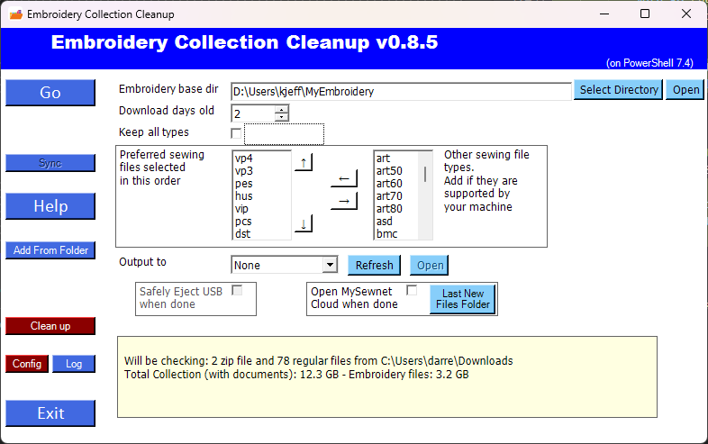

# EmbroideryCollection-Cleanup Help
---
[Read Me Introduction](README.md)

`Go` - start the process of checking the download folder and copying files into the Embroidery base directory.

`Sync` - Synchronize the collection of files (on your computer internal drive) in the Embroidery base directory to MySewnet or the USB drive selected.

`Help` - this help page.

`Add From Folder` - If you want to import from files from different locations on your computer other than the Download folder, then use this button and it will ask what folder you want to search for embroider files (includes those in zip files).

`Clean up` - This is three steps: 
1) clean out non-preferred embroidery files and duplicates from the  local cache, if you uncheck `Keep all types`,  
2) look for duplicates regardless of if there they are in different directory structure if they have the same name and are created on the same day.  It will show a list and prompt  before deleting.  The files are deleted from the **recycle bin** so they can be restored. 
3) it looks for empty or lone file/directories and moves them up.

`Config` - open the configuration file.  If you need to add some additional file types to the 'Other sew files' list, this is a good way to access that list. (Use caution when editing the config)

`Log` - open the log of actions taken.

`Exit` - Do nothing and close

`Embroidery Base Dir` - This is the folder where the Embroidery Collection is stored on your computer.  This should not be a USB drive, but a copy which will be selectively copied to the USB drive.  It will include all the instructions files extracted from the downloads along with the embroidery file of your preferred type.  Just to be safe, this should be a new directory when you first use the program, so make sure that you are not deleting the original Embroidery files.  You could make a folder, copy all your embroidery files into that folder manually, and then use the `Cleanup` button to reorganize them to the necessary files.

`Download days old` - Determine many days again you downloaded the zip files. Choosing hard far back to look if new embroidary files have appeared in your download folder.  The Download folder is usually something like `c:\users\yourname\Downloads`.  It does not look in subdirectories of that folder or other locations.  Normally, you would use 1 for this value, since you will run the program right after downloading your purchases from stores.

`Keep all types` - It is recommended that you do not have this checked and it will only keep the most preferred embroidery file type.  If it is checked, it will keep all the preferred types of pattern files (rather than only the one preferred).  See `preferred Sew Type` below. 

`Safely Eject USB when done` - When you are done load files onto a USB drive, if you remove it too quickly, it may corrupt the drive.  This option will automtically make sure the drive is safe to remove.

`Open MySewnet Cloud when done` - Open the MySewnet Cloud web page when done.  (https://www.mysewnet.com/en-us/my-account/#/cloud/)

`Last New Files Folder` - button will reopen the previously matched files when using MySewnet or 'None' as the Output location.  It open appears if you have used that mode.

## Command-line parameters

| Option | ↘ ◊ | Description
| ------ | ---|--------------- |
| `-Setup` | ↘ |  Interactive setup of parameters, create the directories required, and create a shortcut on the Desktop Icon linked to this PowerShell script.  (This is used during an upgrade cycle)
|`-EmbroidDir` directory|↘  | The local cache of embroidery files and instructions.
|`-CleanCollection` |↘ |This is two steps: 1) clean out non preferred embroidery files and duplicates from the  local cache.  2) look for duplicates regardless of if there they are in different directory structure if they have the same name and are created on the same day.  It will show a list and prompt  before deleting.  The files are deleted to the **recycle bin** so they can be restored. (use `-HardDelete` to delete without recycling)
|`-DownloadDaysOld` x | ↘ | determine how old the zip files is to look for (in days) in this case 5 days
| `-Sync` |↘ | Synchronize the files in the local `EmbroidDir` cache to the USB Stick or Mysewnet Cloud cache (depending on selection above).  This will only copy the preferred embroidery types to the cloud.  This includes creating folders and removing files if they are removed from the local cache (for the Cloud option).  
|`-KeepAllTypes` |↘ ◊ |Toggles the option to Keep all of the preferred types of pattern files (rather than only the top preferred).  Keep all types of a file (duplicate name but different extensions), normally this will find your most preferred file type and only keep that one.  See `preferredSewType` below. 
|`-KeepEmptyDirectory` |↘ ◊ |Toggle option to keep/remove extra empty directories from Collection folders'
| `-USBDrive` I: |↘ |  Copy the new files to a specified USB drive (in the form of I: or H: or E:).  To Disable USB use 'OFF' for the drive letter
| `-CloudAPI` |↘ ◊ |Use MySewNet Cloud to save file after they have been added to the local computer cache  (Either USBDrive or CloudAPI but not both at the same time).  Only preferred embroidery types will be uploaded to the cloud.
|`-DragUpload` |◊ | Toggle option use the web page instead of the plug-in to drag and drop from the folder which gets opened to the web page upload area.
|`-ShowExample` |↘ ◊ |  Toggle option Show the example GIF on how to send files to the cloud (different image for Windows 10 vs Windows 11)  See the example below for demostrations
| `-ConfigDefault` |  |Reset the default settings and options to original default any of the ◊ or ▫ marked options
| `-SwitchDefault` |↘ | Use to turn off the Switches you might have turned on - Any of the ◊ marked options (this is the only command-line way to reset the options because of the config file saving the settings state)
| `-ConfigFile` |↘  | EmbroideryCollection.cfg` The name of the configuration file which is in the same directory as the script itself.  The options selected are saved into the configuration file so the next time the script is run the same settings stay in effect.
|`-Testing`  | | Run it without it doing actual copying of files or cleaning up.

- ◊ - Switches which  can be toggled on or off it was previously on
- ↘ - Deprecated, use the Control Panel to set the switches instead

### Future
- `-OneDirectory` Only put files one folder deep.
- `-NoDirectory` Put files the root directory only.

## Using MySewnet
Read about how to use and access [mysewnet cloud](https://www.mysewnet.com/en-us/studio/article/transferring-designs-via-mysewnet-cloud)

If you want to send your files into MySewnet Cloud, then you will need one additional module [`PSAutheClient`](https://github.com/alflokken/PSAuthClient) from [`alflokken`](https://github.com/alflokken).  It will be automatically installed if required. (Maybe slower is in current user mode instead of computer install)

# Messages - Error or otherwise:
- `(Runs better with a new version of Powershell)`
If you upgrade to Powershell 7 it will run faster.  To do this visit Microsoft  at https://aka.ms/PSWindows or https://learn.microsoft.com/en-us/powershell/scripting/install/installing-powershell-on-windows?view=powershell-7.4#install-powershell-using-winget-recommended 

- `WARNING: Could not access: `
When you get this message, it is usually related to long files name.  This occur if you are using Powershell 5.  To correct this, upgrade to Powershell 7 (see above)

- Any error/access messages when working with Diacritics such as á, é, í, ó, ú :
I try and fix this character so they will work with the cloud, by it is still a bit buggy.

- `The Download Directory does not work, please correct the script` :
Somehow the default download directory is not set on your computer.  This should not happen.  Not sure under what conditions you would see this error message, please create an issue on the github and provide the type of operating system you are running on.
- `The Embroidery files directory c:\users\username\onedrive\Embroirdery  is within OneDrive ---- Warning`
There is a bug in the preview function for the Explorer Add-in which previews it from properly render preview images when it is used within OneDrive.

 - `WARNING: Error Pushing the folder:`  ... `<error-message>Folder can not be found</error-message>` ...  
`WARNING: Problem creating folders \Angels\Angels\Angels ` - Currently the script cannot deal with nested folders with the same name.

- `WARNING: File Not found for upload : D:\Users\kjeff\MyEmbroidery\Angels\Angels\ang5a.DST` - Currently the script cannot deal with nested folders with the same name.

## UPGRADE BUG in v0.8.2
- To overcome a bug to run the upgrade script   If your upgrade from 0.8.2 fails.  You will need to manually do 
  - Start -> Run (and paste this line)
  - `powershell -ExecutionPolicy bypass -file C:\ProgramData\EmbroideryOrganize\install.ps1`

# Clean Up button
Use this function CAREFULLY.  It removes files and reorganizes the folders.
The `Clean Up` button takes a few steps to clean up your collection (it will confirm each step before taking any action):
- Remove duplicates in the collection.
- If you have `Keep all Variation` off then it will look thru the collection and find 'other' format from your preferred format and remove them.
- If will move the folders around by removing unnecessary folders inside of folders. (for example, do you need a VIP folder with 1 file in it?)

# Sending Files to MySewnet

### In Windows 11

### In Windows 10 

Other free software for Windows Explorer Plug-in from https://freesierrasoftware.com/site/get%20it%20now.htm use the dealer code 7393602 or 1234575 to activate.
PREMIER+™ 2 includes an Explorer add-in https://www.premierplusembroidery.com/en/Downloads/PP-Software-Downloads  (This is the same software used for Mysewnet)

[Other Tips](tips.md)
[Files Types](docs/File-Types.md)
[How it works](docs/how-it-works.md)
